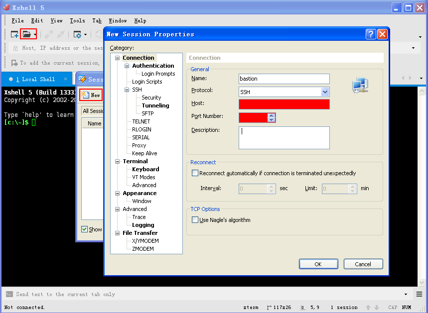
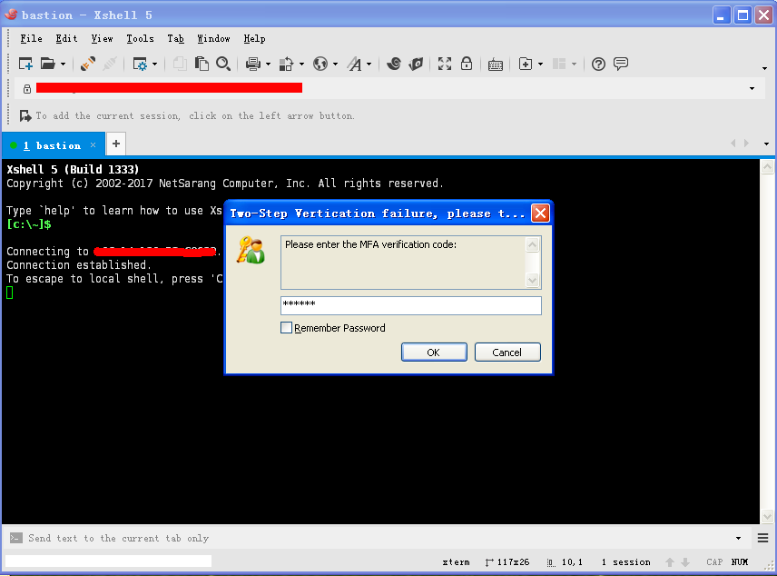
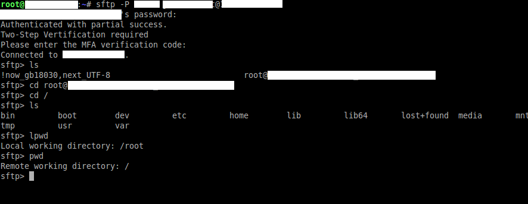
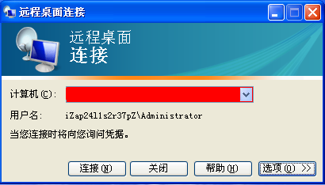
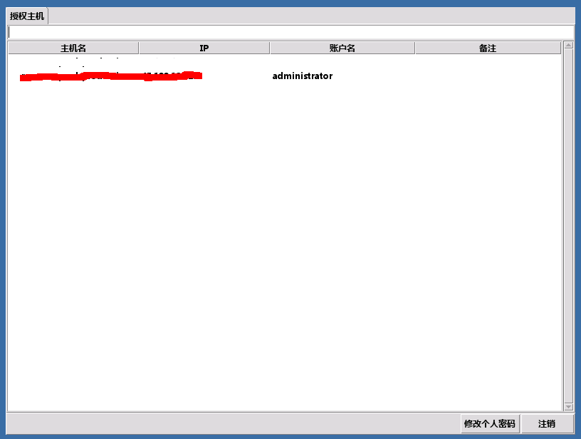

# Secure Bastion Hosts

A bastion host is a server whose purpose is to provide access to a private network from an external network, such as the Internet.

Some security points to be considered:

- Bastion hosts is single point of accessing the private ECS instance; its security should be considered high enough.
- Utilize SSH Identity based login to connect to bastion hosts.
- Harden the bastion by limiting the access from given public IP or IP range.
- Monitor the logins.
- Disable root logins on bastion hosts.
- Have different bastion hosts to connect to production vs development environment.

# Accessing Bastion Host with Aliyun RAM Account

- Once account were created, an email with RAM account login credential and server information will be sent to accoutn owner.
- Login with user name before **@**.
- MFA is required for first time login, detailed steps can refer to this page https://www.alibabacloud.com/help/doc-detail/119555.html?spm=a2c5t.10695662.1996646101.searchclickresult.56c11cec9bKzVn. 
- Reset your MFA account.
- IP whitelist is enabled on bastion host, which shall be provied when requesting the RAM account.

## Access with SSH

Linux and Mac users can use built-in terminal, Windows users can install 3rd party tools like xshell， secureCRT or putty.  Here xshell is used for example.

- Launch xshell to create a new `Connection` with given host IP and port.

- In `Authentication` menu，use given RAM account and password.

- Enter 6-digi MFA token, then click `OK`.

- Once logged in, user can use `UP` and `DOWN` to navigate among different server and press `Enter` to access selected server.

## Transfer Files with SFTP

### In Windows

- xftp is recommended
- Create a new connection with given IP, port, username and password, select `SFTP` protocol.

- Enter 6-digi MFA token, then click `OK`.

- Once logged in, user can view server list and double click on selected server to access.

- Manually enter the path, then press `Enter` to access specific folder path.

### In Linux or Mac

- Linux or Mac users can use built-in terminial to transfer file between local machine and server.
- Run `sftp -P [Port] [RAM Account]@[Bastion Host]` 
- Enter password to login.
- Provide 6-digi MFA token to continue login.
- Use `ls` command to view server list, then `cd [Server]` to access selected server.
- Use `help` command to view supported sftp commands.

## Access with RDP

- Run built-in Remote Desktop Tool, or execute `mstsc` in `Run` menu.
- Enter bastion host Host:Port, then click `Connect`.
- Click "Trust this remote server" in pop-up dialog.
- Click "Yes" if pops "Unable to verify the identity of the secondary remote computer" prompt.

- Enter RAM account and password in pop-up windows, then click `Login`.

- Provide 6-digi MFA token to continue login.

- Once logged in, user can view server list and double click on selected server to access.

