阿里云堡垒机具有运维身份鉴别、账号管控、系统操作审计等多种功能。通过正向代理的方式实现对 SSH 、Windows 远程桌面、及 SFTP 等常见运维协议的数据流进行全程记录，并通过协议数据流重组的方式进行录像回放，达到运维审计的目的。

# 使用阿里云子账号通过堡垒机做运维工作

- 服务器开通后，会邮件回复服务器的相关信息和一个阿里云 RAM 子账号登陆信息，通过该子账号可以登陆堡垒机然后再进入服务器。
- 阿里云 RAM 子账号需要先在 https://signin.aliyun.com/login.htm 登陆，第一次登陆需开启 MFA，详情参见 https://help.aliyun.com/document_detail/28635.html ，MFA 是基于时间的一次性密码，如遇到输入 MFA 动态码报错，请尝试更新手机时间。
- 开启 MFA 后请重置子账号密码。
- 使用子账号登陆堡垒机时，**@** 前的为用户名。
- 申请服务器时会要求填写访问堡垒机公网 IP，只允许该 IP 访问堡垒机。

## 使用 SSH 协议登陆服务器

请确认本地已安装支持 ssh 协议的工具，linux 和 mac 系统可以使用自带终端， windows 系统可以安装 xshell、secureCRT、putty 等工具，本例使用 xshell：

- 打开 xshell 软件，依次点击红框标记按钮新建一个会话，在 Connection 中输入堡垒机的 Host 和 Port。

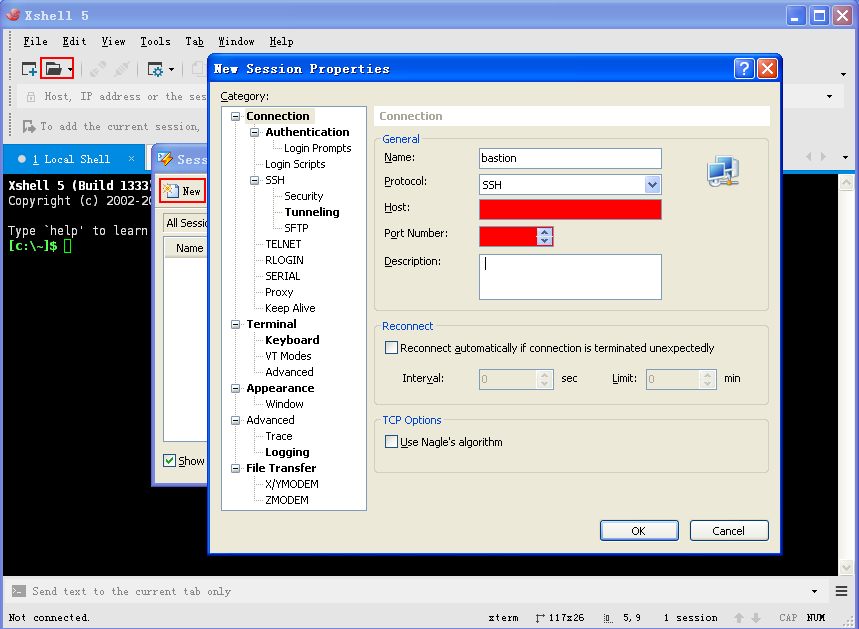

- 点击 Authentication 界面在 Username 框输入子账号，Password 框输入子账号密码，点击 OK 。

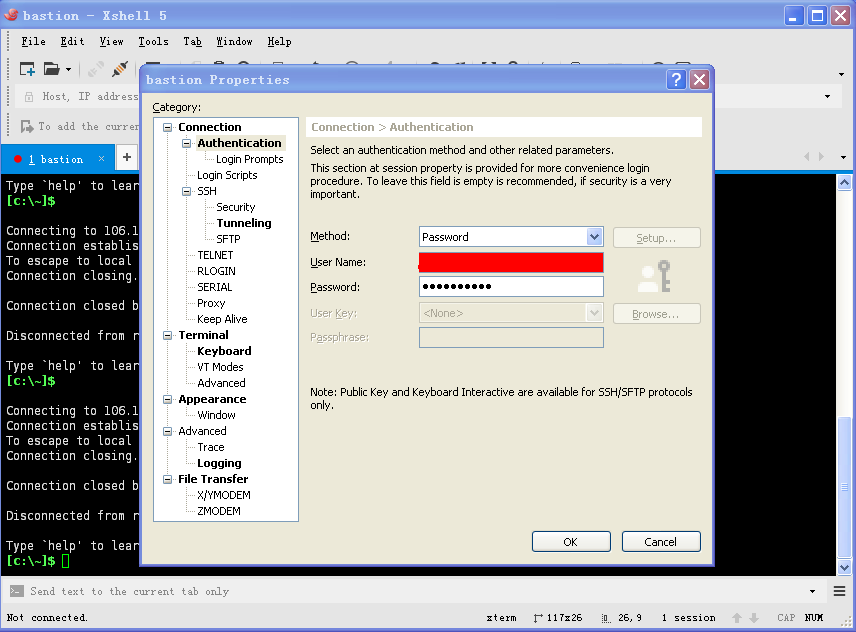

- 输入六位 MFA 动态口令，点击 OK 。

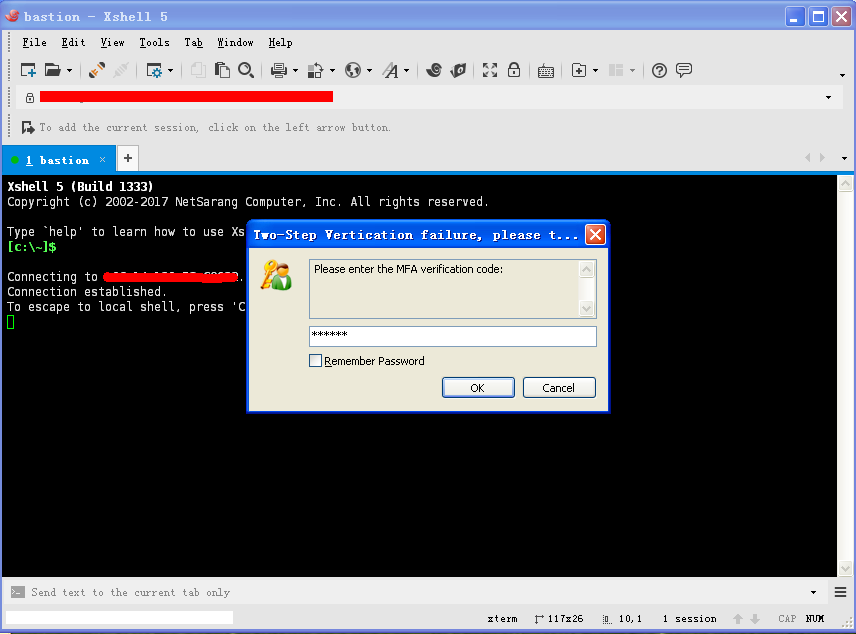

- 成功登陆堡垒机后，可以看到服务器列表，通过键盘上、下箭头选择要登陆的服务器，按回车键即可进入。

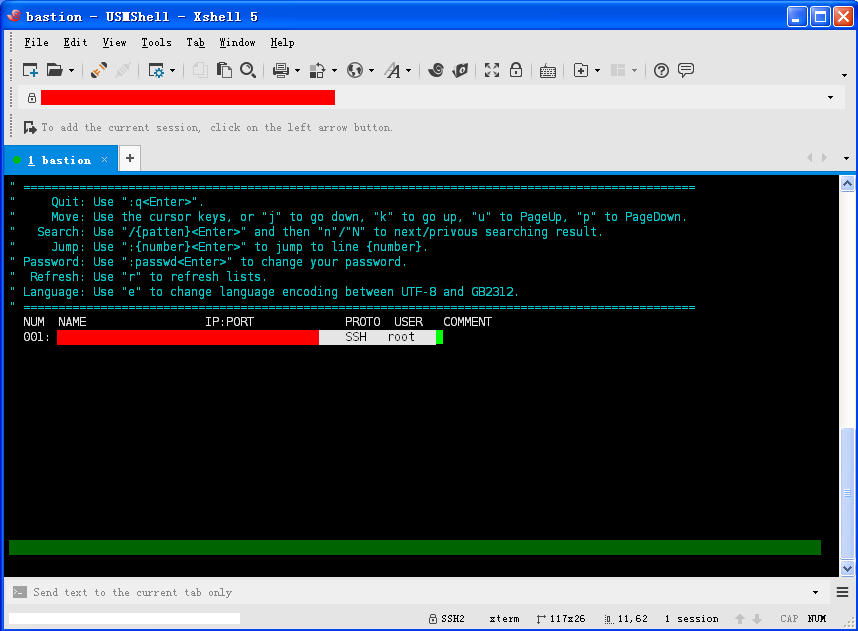

## 使用 SFTP 协议在服务器和本机之间传输文件

### Windows 系统

- Windows 系统请使用 xftp 软件
- 安装后依次点击红框标记按钮创建一个会话，在 General 窗口依次输入堡垒机 Host、选择使用 SFTP 协议，输入堡垒机 Port，在 Username 框输入子账号，Password 框输入子账号密码，点击 OK 。

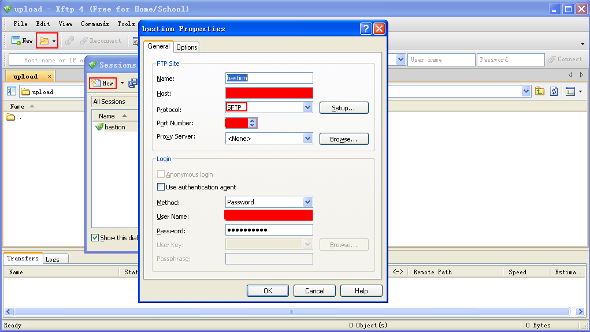

- 输入六位 MFA 动态口令，点击 OK 。

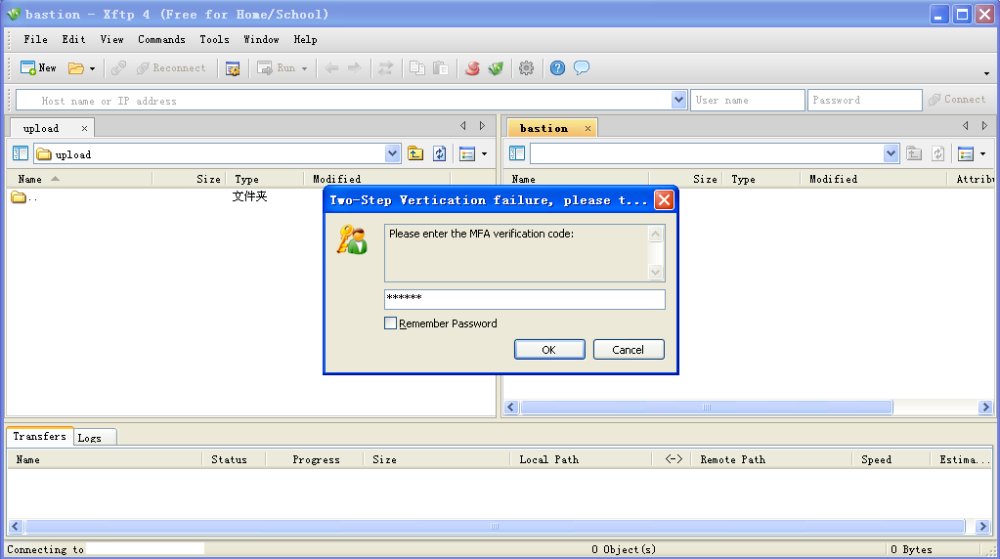

- 成功登陆堡垒机后，在右侧可以看到服务器列表，双击即可进入服务器。

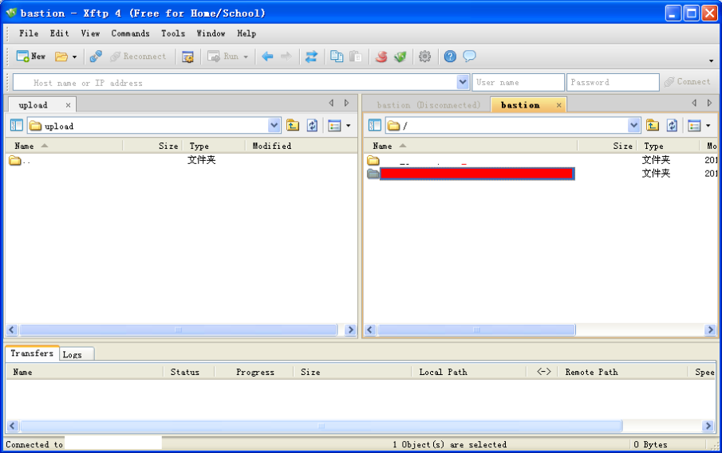

- 在红框位置输入想要进行文件传输的目录，按回车即可进入服务器对应目录。

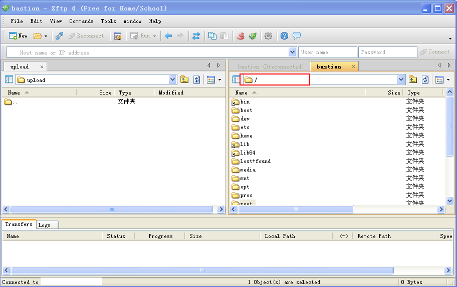

### Linux 或 Mac 系统

- Linux 或 Mac 系统可以用自带的终端软件在服务器和本机之间传输文件。
- 输入 `sftp -P [堡垒机 Port] 子账号@堡垒机Host` 命令按回车，然后会提示输入子账号密码。
- 密码验证成功后会要求输入六位 MFA 动态口令。
- 连接到堡垒机后可以使用 `ls` 命令查服务器列表，用 `cd [服务器]` 命令进入服务器。
- 进入服务器后可以输入 `help` 查看 sftp 支持的命令。

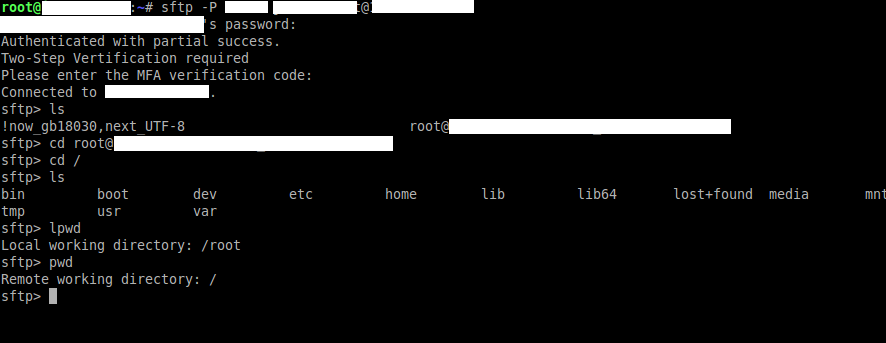

## RDP 协议登陆登陆服务器

- 在本地 Windows 系统主机中打开远程桌面连接工具（可以运行中输入 Mstsc 打开）。
- 输入堡垒机的 Host:Port 点击连接。
- 如弹出**是否信任此远程连接？**对话框，点击连接。
- 如弹出**无法验证次远程计算机的身份。是否仍要连接？**对话框，点击是。

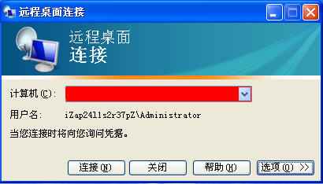

- 在弹出的堡垒机登陆窗口中输入阿里云子账号和密码，点击登陆。

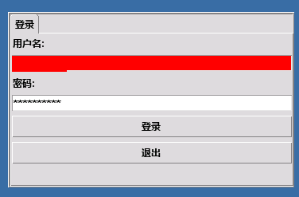

- 在跳出的双因子口令窗口输入六位 MFA 动态口令，点击确认。

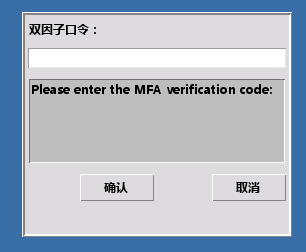

- 登陆堡垒机后会显示服务器列表，双击需要登陆的服务器即可进入服务器的登陆界面。

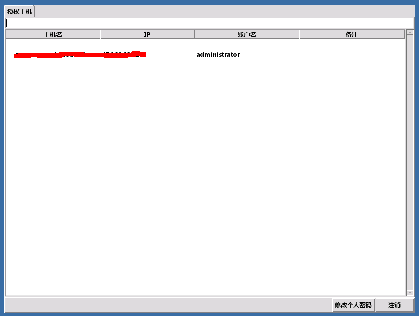
