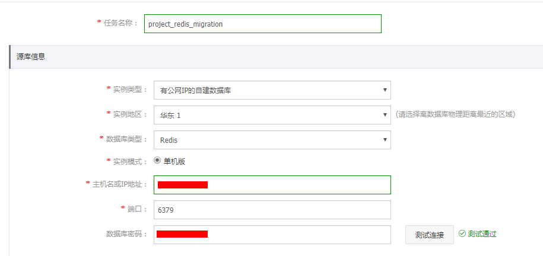

数据传输(Data Transmission)是阿里云提供的一种支持RDBMS(关系型数据库)、NoSQL等多种数据源之间数据交互的数据服务。可实现不停服数据迁移、数据异地灾备等多种业务应用场景。

# 华东2 DTS 地址段

```
112.126.80.0/24,101.200.174.0/24,101.200.160.0/24,101.200.176.0/24,47.94.36.0/24,47.94.47.0/24,182.92.186.0/24,182.92.153.0/24,123.57.48.0/24,123.56.164.0/24,123.56.148.0/24,123.56.137.0/24,112.126.87.0/24,123.56.120.0/24,123.56.108.0/24,112.126.91.0/24,112.126.92.0/24,120.55.129.0/24,47.97.7.0/24,139.196.17.0/24,139.196.18.0/24,139.196.25.0/24,139.196.27.0/24,139.196.154.0/24,139.196.116.0/24,139.196.254.0/24,139.196.166.0/24,106.14.46.0/24,106.14.37.0/24,106.14.36.0/24
```

# 前期准备

- 确保源库已开通公网访问，并已添加华东2 DTS 地址段到白名单中。
- 确保源库账号可以远程登陆。

# 迁移步骤

首先用子账号登陆阿里云控制台 https://signin.aliyun.com/login.htm ，登陆成功后访问 https://dts.console.aliyun.com ，然后在左侧点击**数据迁移**，在上面点击**华东2** ，再点击**创建迁移任务**。

## MYSQL

- 在任名称中输入迁移名称，格式为 ${project}_${dbType}_migration。
- 在源库信息中实例地区选择**华东2**，数据库类型为**MySQL**，输入数据库地址、端口、账号密码等，点击测试连接，测试通过说明连接正常，如测试失败，请检查前期准备工作是否已完成、密码是否正确或是否超过最大错误连接数。


- 在目标库信息中实例地区选择**华东2**，RDS 实例 ID 选择自己项目的实例，括号中有项目标识。


- 输入目标数据库的账号和密码，点**测试连接**，测试通过后点击**授权白名单并进入下一步**。


- 迁移类型可选择**结构迁移**和**全量数据迁移**，如需全量迁移完成后执行增量迁移请把**增量数据迁移**选项也选上。
- 把需要迁移的源数据库选中后点击中击向右箭头移到右边框，在右边框中选中后点**编辑**修改数据库名为邮件中创建好的数据库名称。
- 点击**预检查并启动**。


- 预检查通过后点下一步，如预检查失败，请根据提示修改数据库。


- 选择链路规格为**medium**，同意协议，点击**立即购买并启动**开始执行数据迁移。


## MSSQL

MSSQL 迁移过程同 MYSQL 类似。

## MongoDB

- 在任名称中输入迁移名称，格式为 ${project}_${dbType}_migration。
- 在源库信息中实例地区选择**华东2**，数据库类型为**MongoDB**，输入数据库地址、端口、账号密码等，点击测试连接，测试通过说明连接正常，如测试失败，请检查前期准备工作是否已完成、密码是否正确。


- 在目标库信息中实例地区选择**华东2**，数据库名称选择自己项目的实例，括号中有项目标识。


- 输入目标数据库的账号和密码，点**测试连接**，测试通过后点击**授权白名单并进入下一步**。


- 迁移类型可选择**全量数据迁移**，如需全量迁移完成后执行增量迁移请把**增量数据迁移**选项也选上。
- 把需要迁移的源数据库选中后点击中击向右箭头移到右边框，在右边框中选中后点**编辑**修改数据库名为邮件中创建好的数据库名称。
- 点击**预检查并启动**。


- 预检查通过后点下一步，如预检查失败，请根据提示修改数据库。


- 选择链路规格为**large**，同意协议，点击**立即购买并启动**开始执行数据迁移。


## Redis

- 在任名称中输入迁移名称，格式为 ${project}_${dbType}_migration。
- 在源库信息中实例地区选择**华东2**，数据库类型为**Redis**，输入数据库地址、端口、密码，点击测试连接，测试通过说明连接正常，如测试失败，请检查前期准备工作是否已完成、密码是否正确。



- 在目标库信息中实例地区选择**华东2**，Redis 实例 ID 选择自己项目的实例，括号中有项目标识，输入数据库密码后点**测试连接**，测试通过后点击**授权白名单并进入下一步**。


- 迁移类型可选择**全量数据迁移**，如需全量迁移完成后执行增量迁移请把**增量数据迁移**选项也选上。
- 把需要迁移的源数据库选中后点击中击向右箭头移到右边框，然后点击**预检查并启动**。


- 预检查通过后点下一步，如预检查失败，请根据提示修改数据库。


- 选择链路规格为**large**，同意协议，点击**立即购买并启动**开始执行数据迁移。


